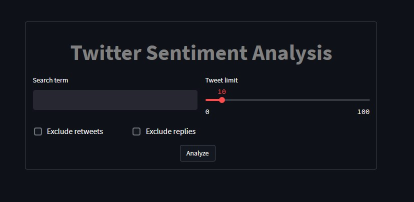
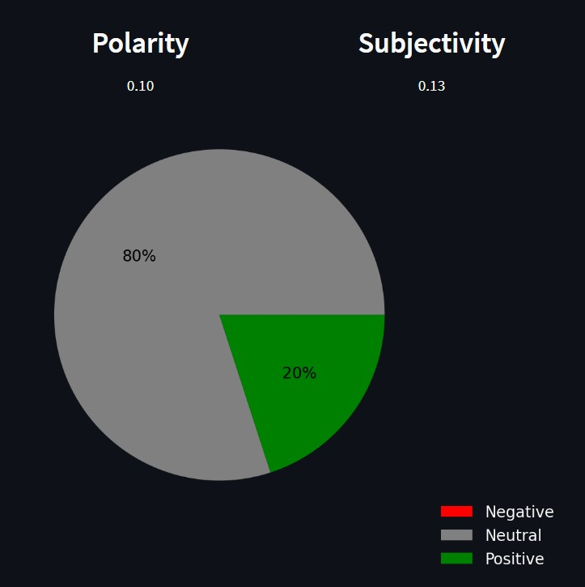
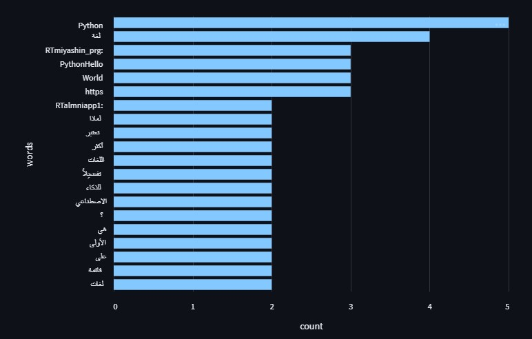
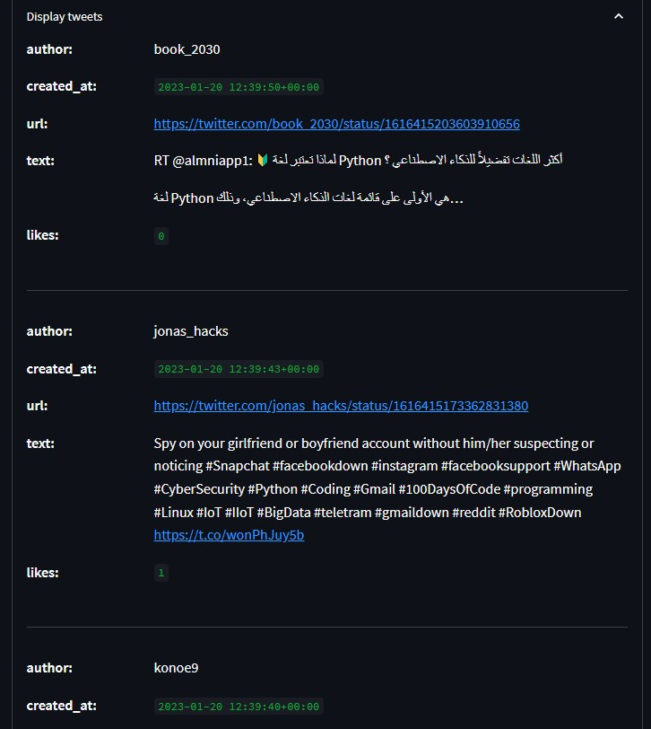

To run the code locally :
```shell
streamlit run streamlit.py
```

### Objectives 
- Learn to use Twitter's API
- Learn to create a simple data vizualisation interface with Streamlit

### What does my app do

- The application allows to search for a key word. You can choose the number of tweets to search and exclude replies and retweets.



- The application will display the polarity, the subjectivity values and the sentiments as a pie chart.


- It then shows the 20 most used words in the tweets retrieved.


- Finally, by clicking on the dislpay tweets box, you can display the tweets retrieved by the api.


### Techs, softwares, librairies…
- Opera GX
- Vscode 
- Github Desktop
- Streamlit
- TextBlob
- Matplotlib

### Credits

- Regex expressions for cleaning the tweet:
https://github.com/streamlit/example-app-twitter-analyzer/blob/main/streamlit_app.py